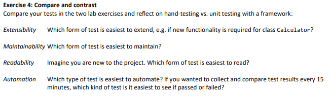

### Exercise 4: Compare and contrast

- *Extensibility*
	- Unittesting gør det langt nemmere at udvide, da nye test kan tilføjes uden at skulle ændre eksisterende tests. Især hvis man bruger `[TestCase]`. 
- *Maintainability*
	- Unittesting gør det lideledes lettere at vedligeholde, da test er struktureret på sådan en måde at opdateringer og fejlfinding bliver mere overskuelig.	
- *Readability*
	- Da strukturen i Unittesting er ensartet og der tydligt er defineret forventet resultater, bliver læsbarheden højere end ved håndtestning. 
- *Automation* 
	- Unittesting er mere oplagt at automatisere, da man med testrunners kan køre test på fastlagte tidspunkter og dermed generere test-rapports og evt. fails-flags kan opdages tidligt.   
